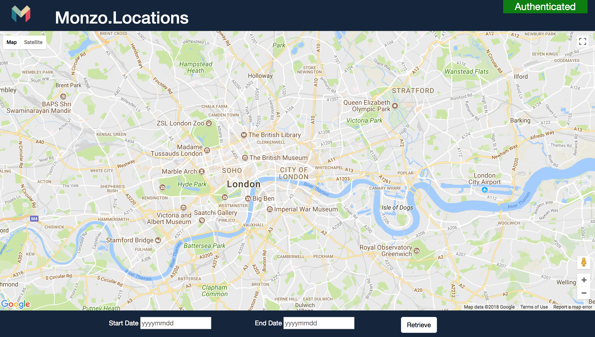
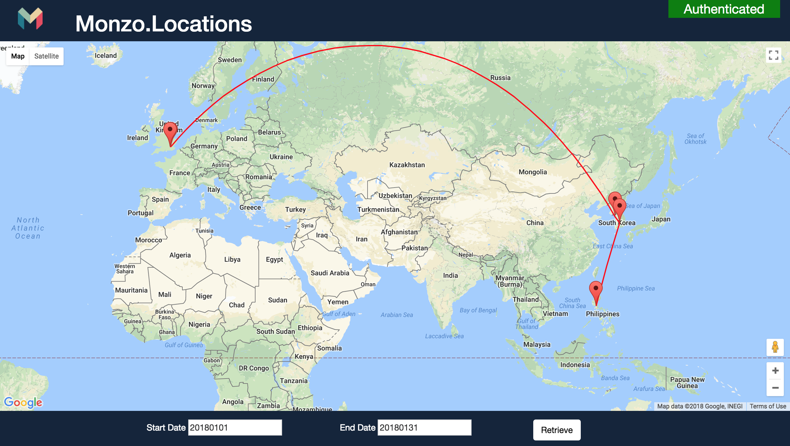

# Monzo.Locations 🚀 

Monzo.Locations is an application based on the [Monzo API](https://monzo.com/docs/) to provide visualisations on transactional data. 

## Setup 

1. Clone the Repository
2. Set up the Environment Variables

```sh
export MONZO='<access_token>'
export GOOGLEMAPS='<google_maps_api_key>'
```

You can get your Monzo Access Token from [here](https://developers.monzo.com/) and Google key from [here](https://console.developers.google.com).

*Currently the project only supports access token authentication for the monzo API. This is because I was having some difficulty setting up the authentication with the OAUTH2 service since I do not have anywhere to host the redirect url.*

3. Launch the the `Monzo.Locations.Web` application. If you are launching from Visual Studio on Mac then please take into account this [issue](https://www.placona.co.uk/1592/dotnet/osx-pro-tip-for-environment-variables/). 

## Example
If all is well then you should see the following landing screen. *Notice the Authenticated sign on the top right corner.*


Then all you need to do is enter the range in which you want to see transactions and click `Retrieve`.




*This project has no affiliation with Monzo themselves. I am merely a sole developer making use of the API that they provide.*
